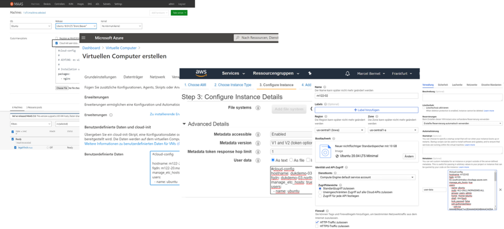

Cloud
-----

- - - 

Alle grossen Cloud Anbieter unterstützten [Cloud-init](https://cloudinit.readthedocs.io/en/latest/).

Erstellt eine VM, mit Ubuntu 20.x (oder höher), in der Cloud Eurer Wahl und kopiert den Inhalt einer der `*.yaml` Dateien von [Modules](../modules/) in das Cloud-init Feld.

Dieses Feld, ist je nach Cloud Anbieter, als
* Benutzerdefiniertes Feld
* User data
* etc.

bezeichnet.