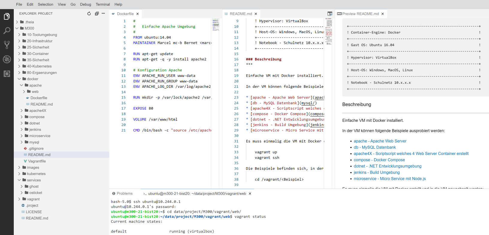

VM Hilfsscripts
===============

Folgende Hilfsscripts installieren weitere Software und Services in den VMs.

     
Eclipse Theia
-------------

- - -

[Eclipse Theia](https://theia-ide.org/) ist eine Entwicklungsumgebungen (IDE), angelehnt an VSCode, welche im Browser läuft.

Das Script `eclipse-theia.sh` startet die IDE in einem Container und stellt die IDE auf Port 32400 zur Verfügung.

modtec
------

Umgebung für den Kurs [Moderne Technologien](https://github.com/mc-b/modtec) u.a. Mosquitto, Kafka, etc.

Wird für mehrere Kurse verwendet, deshalb hier als Script ausgeführt.

Proxy Server
------------

Das Script proxy-server.sh installiert und aktiviert den Proxy Server Privoxy und den [ngrok](ngrok.com) Client in der VM.
 
Mit dem Proxy Server können die Einschränken, dass bestimmte Webseiten, z.B. ngrok.com nicht angewählt werden können, umgangen werden.
 
Dazu muss auf dem Notebook der Lernenden die VM (IP von WireGuard und Port 8118) als Proxy Server angegeben werden (siehe oben und hier). Anschliessend erfolgt der Zugriff auf des Internet via -> NB -> VM mit Proxy Server -> init 7 Standleitung (cloud.tbz.ch).
 
Aktuell ist dieses Settings in das Modul 242 eingebaut.

